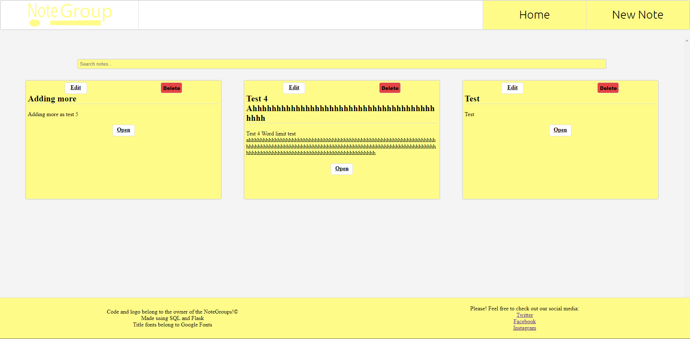
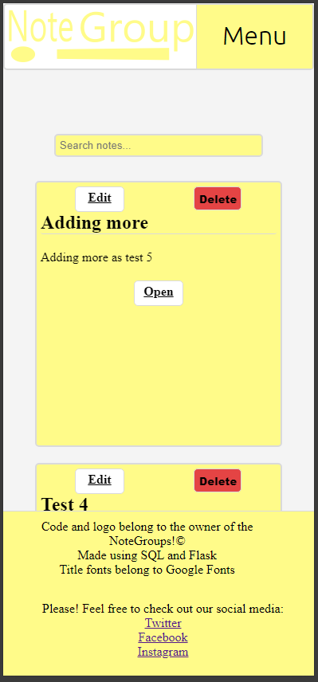
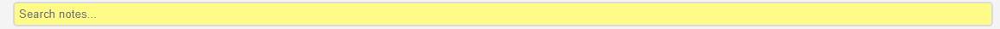
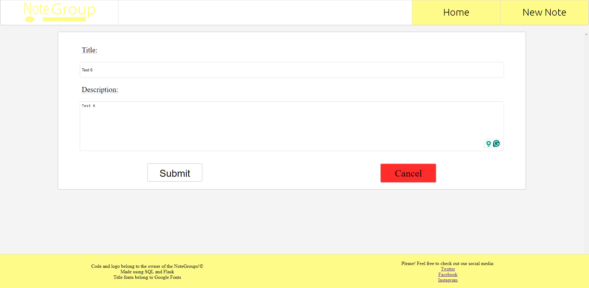
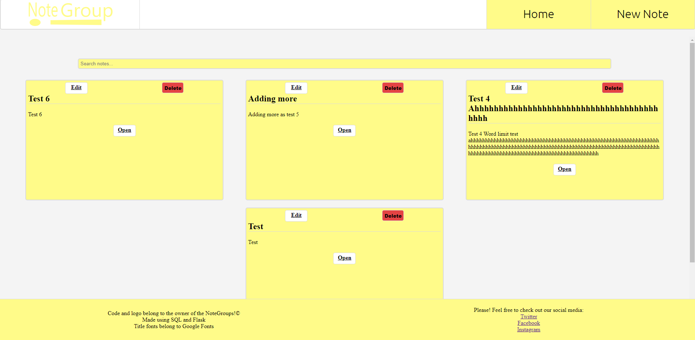
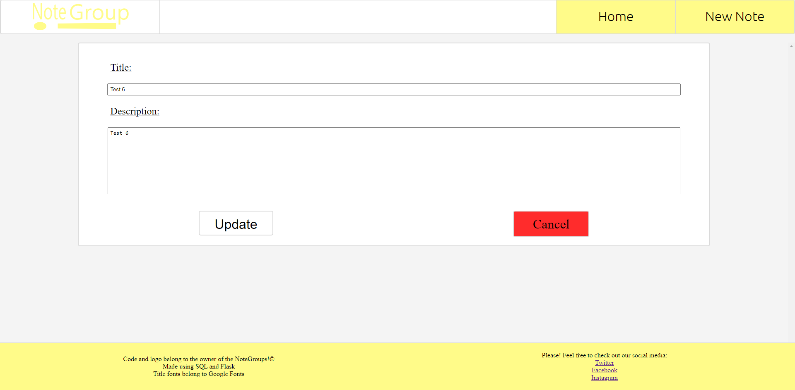
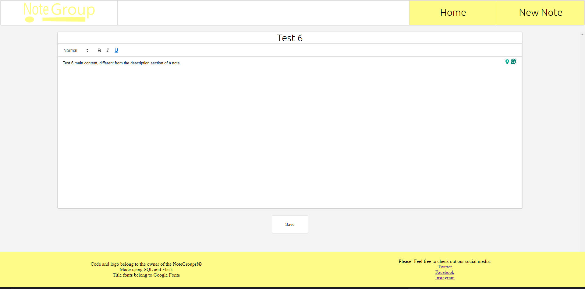
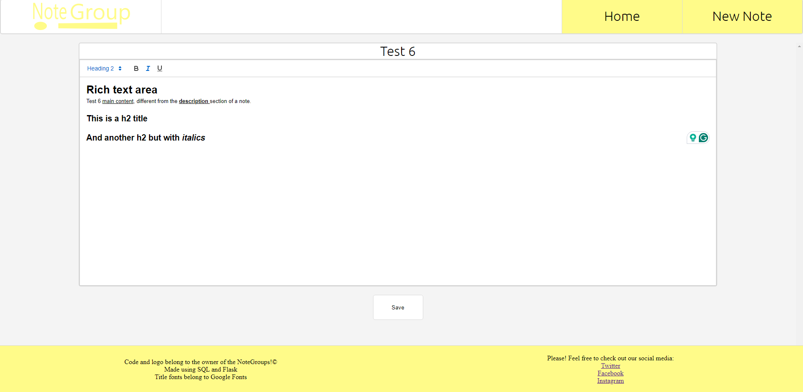
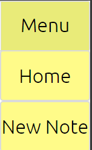

# Note Groups!

## UX

### Project Goal
The goal of 'Note Groups!' is to create a website that hosts documents created by the user. The website will be broken into three template webpages: Home, Note, and Create Note. Home will display all created notes as postit notes, which when clicked on will take the user to that note. The note will be displayed on the Note page, and will be filled in with data from the database. Lastily, the link Create Note will lead the user to a page where they name and create a new note, which will automatically load the new note on creation.

#### Minimum viable product goals

The minumum viable product would have the home page list all Notes with no specified ordering and no styling, displaying the title the user gives the document. These Notes when clicked on will open a page containing text saved to the document id in the database. The Create Note link will successfully create a new note that will store content into the database and appear on the homepage.

#### Additional goals

Additional features I wish for the website are to be user complimentary features. A search bar at the top of the homepage to search through existing Notes, and when no results are found, instead offer a link to the Create Note page. Inside the Note page, the user will have the ability to add basic text effects to the documents, such as bold, italic and underline text, as well as change font size, font colour, and font background/highlight, with these css stylings being saved to the database as well. The list of notes on the Homepage to be ordered by the last saved document. Add a way for the user to add multiple notes/text documents to a Note (to make a 'Note Group').

### User goals

#### First Time User

- To be able to quickly and easily navigate the layout of the website
- To be able to create a new note in three clicks or less
- To be able to create a note and save it to the database

#### Returning User

- To be able to load already created notes
- To be able to edit old notes and have those changes replace the old document
- To be able to delete a note in four clicks while still having protective measures

#### Dedicated User

- To be able to search through multiple notes on the homapage with ease by making notes titles clear, easy to read, and possibly with a search bar
- For notes to load quickly even at larger sizes
- For the homepage to load notes at an acceptable speed

### Design

#### Colour Choices

I wish to mimic the appearence of paper notes, like the lined paper in a note book or a shopping list, and as such I have decided to go for a white background, light grey accents/borders, and pale/soft colours. Then further borrowing the aesthetics from sticky notes, I came to the decision that my colours could be green, yellow, blue, or pink, the most common and famous colours of sticky notes, and ultimately decided I will go with a pale yellow.

I decided to choose yellow due to three reasons:

1. Colour theory explains the colour yellow is assossiated with happyness, with pleasent positive emotions
2. The same yellow can be used as for the high-lighter if I can add the additional goal of css styling being saved to the database, create a constant colour pallete across the webpage
3. It matches the colour of standard paper notes

I decided to choose white due to two reasons:
1. The colour white has high contrast range, especially with black which is standard
2. The brightness/high value keeps the website feeling light and enegetic

I decided to choose light grey due to two reasons:
1. It works as a good border/accent colour to both yellow and white
2. It matches the colour of the lines usually found in notes and note pads
3. Not an aggressive colour, it will not tear the user's attention away from the content of the website by being distracting

With my choices of white, grey, and pale yellow chosen, I have decided to dedicate these colours to:

##### White
- The background of all pages
- The background of the notes
- The background of buttons
- The background of the header
- The text colour of buttons on click/mousedown
- Footer text colour

##### Grey
- Borders on divs
- The border of buttons
- The background of buttons on click/mousedown
- Border of notes on the homepage

##### Yellow
- The background of flash messages
- The background of the footer
- The background of buttons in navigation

Text will remain generic black unless specified elsewhere.

#### Wireframes And Logic

#### Wireframe

#### Databse Logic

Down below is the planned database columns and their data storage types.

|Data column|Data type
|:---|:---|
|id|Int
|title|Str
|description|Str
|note_content|Txt
|date_updated|Date

'id' Will be the primary key and will increment with every new note created/enters the entry.
 
'title' Will be a string to be displayed on the home page and at the top of a note.
 
'description' Is an optional field and will be displayed on the home page.
 
'note_content' Will be the content of the note. I plan to save it as an html with user being able to 'edit' the html with a rich text editor.
 
'date_updated' Will contain the date whenever the file is updated for sorting on the homepage.

## Final Features/Product

### Deployment

#### Creating The Database For My Website

The first step was installing Flask, SQLAlchemy, and psycop using the following command line in the terminal:

pip3 install 'Flask-SQLAlchemy<3' psycopg2 sqlalchemy==1.4.46

Afterwards, I had to update Flask to a later model due to avoid hitting an error later, as advice by a college in one of meetings with our tutor. The command line used in the terminal was as follows:

pip3 install --upgrade --user Flask==2.3.3

With the sytems in place, I quickly built the initial required pages for a website (such as run.py, home.html etc.) before creating models.py. This is to contain the database schema for all the notes. This is what the created code looks like below:

Afterwards, I proceded to update my routes.py to import 'Notes' from the above module for future use.

I followed this up by then connecting to sql and creating the databse in the terminal.

I then used the python interpetor in the terminal to make the postgres database populated with the table from models.py.

#### GitHub

After creating my website, the first step was to set up a requirements.txt file which will contain the Python dependencies, this can be done by using the terminal and inputting the following command:

    pip freeze --local > requirements.txt

Next, Heroku requires a Procfile with a command to run my program/website. As such, I created a new file called 'Procfile' and filled it with the following line at the bottom with no spaces or paragraphs afterwards.

    web: python run.py

The stage afterwards is to open up my init file and add an 'if' statement as seen below:

    if os.environ.get("DEVELOPMENT") == "True":
        app.config["SQLALCHEMY_DATABASE_URI"] = os.environ.get("DB_URL")
    else:
        app.config["SQLALCHEMY_DATABASE_URI"] = os.environ.get("DATABASE_URL")

Then I needed to make sure SQLAlchemy can read our database, and this is done by making sure the url starts with: 'postgresql://'. However, this should not be changed in the environment variable, so I added this to the 'else' statement from above. So now it is:

    if os.environ.get("DEVELOPMENT") == "True":
        app.config["SQLALCHEMY_DATABASE_URI"] = os.environ.get("DB_URL")
    else:
        uri = os.environ.get("DATABASE_URL")
        if uri.startswith("postgres://"):
            uri = uri.replace("postgres://", "postgresql://", 1)
        app.config["SQLALCHEMY_DATABASE_URI"] = uri

I then add, commit, and push this all to GitHub.

#### Heroku And The Database

# DO THIS!!!!!!!!!!!!!!!!!!!!!!!!!!!!!!!!!!!!!!!!!!!!!!!!!!!!!!!!!!!

### Features

By comparing my notes of listed features, both 'minimum viable product goals' and 'additional goals', from the start of the README, I can test if I have achieved them.

#### Current Features

* Home page list all notes with ordering by last opened/edited

The home page lists all notes created by the user, and lists them by the date in which they were opened. Each note has three buttons that can edit, delete, and open notes to be read. The bold yellow background of the notes, buttons, and search bar against the white backbground of the page makes them stand out brightly, and by making them all interactive as well, it creates a consistant message to user just entering the website: yellow usually contains something interactive. The note buttons and nav buttons all react to user input, and when hovered over their styling changes.

The page itself is interactive, shifting the layout and preportions for different screen sizes. The number of notes displayed on the page in a row changes from 3 on large screens, 2 on medium screens, and 1 on small screens.

* A search bar at the top of the homepage to search through existing Notes

The home page has a search bar to allow the user to quickly locate desired notes. The search bar updates on every user input, and hides notes that do not match the user's input.

* The New Note link successfully creates a new note that will store content into the database, then appears on the homepage.

Clicking on the nav button New Note brings the user to a new page where then can create data to be stored into the database. Upon creation, the home page will automatically update with the new note.

* Edit page button will allow the user to edit the note

The edit button contained on every note will open up a page very similar to the New Note page. This time the input fields will be filled with the user's previous saved input to allow for easy updating/editing of the notes description and title before letting the user save the changes to the database.

* Notes when clicked on will open a page containing text saved to the document id in the database.

Upon clicking the open button on a note, it will load a page that will display the 'content' of the note. This is a rich text area handled by Quill's Api. Here, the user can create, edit, delete, read, and save content to the database.

* Inside the Note the user has the ability to add basic text effects to the documents, such as bold, italic and underlined

Thanks to the rich text area provided and handled by Quill, the user has the ability to add titles, bold text, italic text, and underlined text to the text area. All of this is saved to the database in a Text format for quick and easy unpacking later.

#### Features To Be Added

Due to time restrictions, these are features I listed at the start of the README but have not been completed. All of them are listed as additional goals and not anything required to make a minimum viable product.

* Searchbar will offer a link to create a new note if no results are found

* CSS functions in the notepage, for example, highlighting and text colour

* Add a way for the user to add multiple notes/text documents to a Note (to make a 'Note Group')

### Error Solving

#### Bug Fixing

Submit Error

I had noticed while using Quill's api that you can insert an 'a'/href link in the text area. However, when the user uses this feature, they click on a 'save' button to create the link. The note seems to work fine until the user tries to save the note itself later. Saving the note break it for ever by making the note uneditable html afterwards, regardless if the user closes and reopens the note. This also happens with bold text and and the bullet list option.

Before:

Afterwards:

Seeing as the edits/additions to the notes are being successfully submitted to the databse, this seems to be a rendering error and not a submission error. This is further proven with a syntex error on the line of code that edits the text area's html to be filled with the saved html content (quill.root.innerHTML = "{{ note.note_content|safe }}";) (image below).

Looking into the console for an explanation gave two errors:

Syntax error

No resource found with given identifier

I promptly search for these errors involving Quill, yet do not find any results related to my problem. The reason for this I believe is that quill uses its own method to save its data using the methods getContent and setContent. Yet, even when implmenting these two methods into my code, I still encountered errors. After 8 hours, I still could not get the text editor to accept any special characters or CSS styling in the text editor area.

This led to me having to make the choice: rewriting the website, database, routes, and javascript files, or, cutting out the CSS/special characters features.

Due to time restraint of the project, I decided to cut the features instead of trying to fix an api I did not understand. Thus bug fixing now became trying to find a way to remove the features currently breaking the editor.

Searching the api documents I find the section that discussed the toolbar and options. The link to it is <a href="https://quilljs.com/docs/modules/toolbar" target="_blank">here</a>

There it lists code to be put into the script section of a html page to dictate what options will be available to the user, and using this, cut down the available selection down to: headers, bold, italic, and underline.

I have tested that the remaining options do not break the editor.

Now, regardless if I use any of the remaining options in any combonation, the editor will save and display without breaking.

## Testing

### BBD vs TDD

#### Differences Between BDD And TDD

The main difference between BDD (Behaviour Driven Development) and TDD (Test Driven Development) is that BDD is about tests being done manually while TDD is about tests being checked automatically by the computer. TDD is written before the software and improved to meet updated goals, the cycle repeating over and over until the product is finished and passes all tests. BDD is tested as the code is written against the user stories, with the user manually checking changes on different media and screen sizes until completion. BDD tests can cause the program to end up feeling more intuitive and require no software, leading it to be simpler for a developer. Meanwhile, TDD can test extreme conditions and more conditions at a very fast rate, causing the program to end up being more stable.

#### Why I Chose BDD Testing

#### BDD Example With Group Notes

When I, the user, enter the website, I wish:
* To be able to navigate the navigation bar with ease
* To be able to edit the my notes
* To have all links work

### Testing User Goals Using BDD

Using the user goals I listed at the start of the README, I can use BDD testing to check if I have achieved the goals:

#### First-time Users

- To be able to quickly and easily navigate the layout of the website

The navigation bar and note buttons are easy to navigate with text clearly stating what they are. Text and colours are bold, interactive, and clearly visible, making them have strong readability.

- To be able to create a new note in three clicks or less

From anywhere on the website, the user can select the nav link to create a new note in one click on large/medium screens or two clicks on mobile.

- To be able to create a note and save it to the database

Creating a new note successfully gets saved to the database to be brought up and used again later.

#### Returning User

- To be able to load already created notes

Created notes can be opened on the homepage.

- To be able to edit old notes and have those changes replace the old document

On the home page there is a button on every note that allows the editing of the title and description of the note. The main content of the note can also be opened and changed in the note rich text editor.

- To be able to delete a note in four clicks while still having protective measures

When it comes to deleting a note, it can be achieved in two clicks, bringing it well within the targetted number of clicks. When deleting a file, it will first bring up a pop-up that will ask the user to confirm they wish to delete the note, adding a protective measure to data deletion.

#### Dedicated User

- To be able to search through multiple notes on the homapage with ease by making notes titles clear, easy to read, and possibly with a search bar

Titles are bold and easy to read. A functioning search bar also exists to help siff through notes.

- For notes to load quickly even at larger sizes

Simple text and styling causes notes to load at a rapid pace, even as their size begins to grow large.

# Page load times here!!!!!!!!!!!!!!!!!!!!!!!!!!!!!!!!!!!!!!!!!!!!!!!!!!!!!!!!!!!!!!!!!!!!!!!!!!!!!!!!!!!!!!!!!!!!!!!!!!!!!!!!!!!!!!!!!!!!!!!!!!!!!!!!!!!!!!!!!!!!!!!!!!!!!!!!!!

- For the homepage to load notes at an acceptable speed

Due to notes not having images, limted styling, and limited text length, the load they put on load times is minimal.

# Page load times here!!!!!!!!!!!!!!!!!!!!!!!!!!!!!!!!!!!!!!!!!!!!!!!!!!!!!!!!!!!!!!!!!!!!!!!!!!!!!!!!!!!!!!!!!!!!!!!!!!!!!!!!!!!!!!!!!!!!!!!!!!!!!!!!!!!!!!!!!!!!!!!!!!!!!!!!!!

### Validators

#### Home

#### New Note

#### Edit Note

#### Note

## Technology Used

### Languages Used

HTML

CSS

Python

Javascript

jQuery

Flask

SQL

### Code, Media, Content, Frameworks, Libraries, & Programs Used

<a href="https://validator.w3.org/">W3C</a>

Used to find errors and help correct them in my HTML.

<a href="https://jigsaw.w3.org/css-validator/">Jigsaw</a>

Used to find errors and help correct them in my CSS.

<a href="https://jshint.com/">jshint</a>

Used to find errors and help correct them in my JS.

<a href="https://fonts.google.com/">Google Fonts</a>

Used in title elements using the Ubuntu family of fonts.

<a href="https://jquery.com/">jQuery</a>

Used in the interactive elements within my website.

<a href="">Flask</a>

Used for creating the backend of the website, managing routes, handling requests, and rendering templates.

<a href="https://www.sqlalchemy.org/">SQLAlchemy</a>

Used for database management, enabling interaction with the database, and mapping objects to database tables.

### Thanks And Acknowledgements

Code Institute for teaching me the knowledge of web development and providing a library of resources to return to for help.
