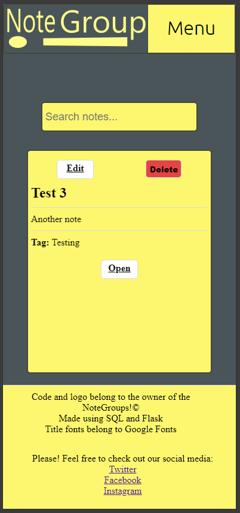
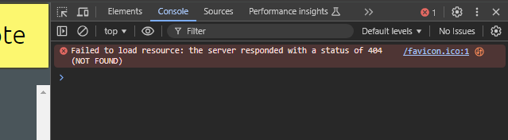
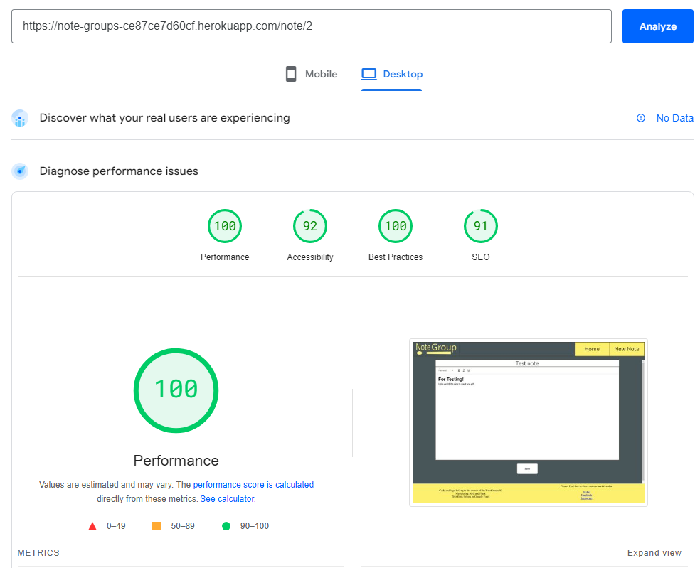

# Note Groups!

## UX

### Project Goal
'Note Groups!' aims to create a website that hosts documents created by the user. The website will be broken into three template webpages: Home, Note, and Create Note. Home will display all created notes as post-it notes, which when clicked on will take the user to that note. The note will be displayed on the Note page and be filled in with data from the database. The user will have the ability to create, edit, and delete these notes as they wish.

### Audience

Group Notes is targeted at users requiring simple and quick notes, for example, students or workers who need to take quick notes and then quickly access them later. As such, the website has to be: simple, quick, and easy to navigate. Due to this the website has to be minimalist in design and layout, with options to add basic titles and text styling to the notes. The business plan is to use the social links in the footer to bring users to other products and create awareness to the company/brand.

#### Minimum viable product goals

The minimum viable product would have the home page list all Notes with no specified ordering and no styling, displaying the title the user gives the document. These Notes when clicked on will open a page containing text saved to the document id in the database. The Create Note link will successfully create a new note that will store content in the database and appear on the homepage.

#### Additional goals

Additional features I wish for the website to have are user complimentary features. A search bar at the top of the homepage to search through existing Notes, and when no results are found, instead offer a link to the Create Note page. Inside the Note page, the user will have the ability to add basic text effects to the documents, such as bold, italic and underlined text, as well as change font size, font colour, and font background/highlight, with these CSS stylings being saved to the database as well. The list of notes on the Homepage is to be ordered by the last saved document. Add a way for the user to add multiple notes/text documents to a Note (to make a 'Note Group').

### User goals

#### First Time User

- To be able to quickly and easily navigate the layout of the website
- To be able to create a new note in three clicks or less
- To be able to create a note and save it to the database

#### Returning User

- To be able to load already created notes
- To be able to edit old notes and have those changes replace the old document
- To be able to delete a note in four clicks while still having protective measures

#### Dedicated User

- To be able to search through multiple notes on the homepage with ease by making note titles clear, easy to read, and possibly with a search bar
- For notes to load quickly even at larger sizes
- For the homepage to load notes at an acceptable speed

### Design

#### Colour Choices

I wish to mimic the appearance of paper notes, like the lined paper in a notebook or a shopping list, and as such I have decided to go for a white background, light grey accents/borders, and pale/soft colours. Then further borrowing the aesthetics from sticky notes, I came to the decision that my colours could be green, yellow, blue, or pink, the most common and famous colours of sticky notes, and ultimately decided I will go with a pale yellow.

I decided to choose yellow for three reasons:

1. Colour theory explains the colour yellow is associated with happiness, with pleasant positive emotions
2. The same yellow can be used for the high-lighter if I can add the additional goal of CSS styling being saved to the database, create a constant colour pallet across the webpage
3. It matches the colour of standard paper notes

While I now have my theme/main colour, I need more to fill the other roles for my website. After some planning, I have picked the additional colours of white, grey, blue, and red. I have chosen these colours for the reasons listed below:

I decided to choose white for two reasons:
1. The colour white has a high contrast range, especially with black which is the standard text colour that I will be using
2. The brightness/high value keeps the website feeling light and energetic

I decided to choose light grey for three reasons:
1. It works as a good border/accent colour to both yellow and white
2. It matches the colour of the lines usually found in notes and notepads
3. Not an aggressive colour, it will not tear the user's attention away from the content of the website by being distracting

I decided to choose blue for two reasons:
1. Its dark tones are a high contrast compared to white and and yellow
2. It's a good counterbalance to all the high colour values, making the website softer to look at

I decided to choose red for a single reason:
1. It often warns of danger and as such can be used to warn the user about an action

With my main colour choices of white, grey, blue, red, and pale yellow, I have decided to dedicate these colours to:

##### White
- The background of the notes
- The background of buttons related to creating/updating the database
- The text colour of cancel buttons on click/mouse down

##### Grey
- Borders on divs
- The border of buttons
- The background of buttons on click/mouse down
- Border of notes on the homepage

#### Blue
- Background of the website

#### Red
- Cancel buttons
- Delete buttons

##### Yellow
- The background of flash messages
- The background of the footer
- The background of buttons in navigation

Text will remain standard black unless specified elsewhere.

### Typography
The majority of the text will use the web-standard Sans-Serif text font. Important titles will the Ubuntu font. Ubuntu is chosen due to it being similar in visual style to San's serif, while still having some extra flair. The large title will be set at 32px. Standard font will be set to standard font size.

#### Wireframes And Logic

#### Wireframe

#### Database Logic

Down below are the planned database columns and their data storage types.

Note:
|Data name|Data type
|:---|:---|
|id|Int
|title|Str
|description|Str
|note_content|Txt
|date_updated|Date
|tag_id|Int (foreign)

Tag:
|Data name|Data type
|:---|:---|
|id|Int
|name|Str

'id' Will be the primary key and will increment with every new note created/entered the entry.
 
'title' Will be a string to be displayed on the home page and at the top of a note.
 
'description' Is an optional field and will be displayed on the home page.
 
'note_content' Will be the content of the note. I plan to save it as an HTML with the user being able to 'edit' the HTML with a rich text editor.
 
'date_updated' Will contain the date whenever the file is updated for sorting on the homepage.

Seeing how tags are how notes are 'grouped', the final database relationship set-up will be a 'many-to-one' as displayed below.

## Final Features/Product

### Deployment

#### Creating The Database For My Website

The first step was installing Flask, SQLAlchemy, and Psycop using the following command line in the terminal:

pip3 install 'Flask-SQLAlchemy<3' psycopg2 sqlalchemy==1.4.46

Afterwards, I had to update Flask to a later model to avoid hitting an error later, as advised by a colleague in one of the meetings with our tutor. The command line used in the terminal was as follows:

pip3 install --upgrade --user Flask==2.3.3

With the systems in place, I quickly built the initial required pages for a website (such as run.py, home.html etc.) before creating models.py. This is to contain the database schema for all the notes. This is what the created code looks like below:

Afterwards, I proceeded to update my routes.py to import 'Notes' from the above module for future use.

I followed this up by then connecting to SQL and creating the database in the terminal.

I then used the Python interpreter in the terminal to make the Postgres database populated with the table from models.py.

#### GitHub

After creating my website, the first step was to set up a requirements.txt file which will contain the Python dependencies, this can be done by using the terminal and inputting the following command:

    pip freeze --local > requirements.txt

Next, Heroku requires a Procfile with a command to run my program/website. As such, I created a new file called 'Procfile' and filled it with the following line at the bottom with no spaces or paragraphs afterwards.

    web: python run.py

The stage afterwards is to open up my init file and add an 'if' statement as seen below:

    if os.environ.get("DEVELOPMENT") == "True":
        app.config["SQLALCHEMY_DATABASE_URI"] = os.environ.get("DB_URL")
    else:
        app.config["SQLALCHEMY_DATABASE_URI"] = os.environ.get("DATABASE_URL")

Then I needed to make sure SQLAlchemy could read our database, and this is done by making sure the URL starts with: 'postgresql://'. However, this should not be changed in the environment variable, so I added this to the 'else' statement from above. So now it is:

    if os.environ.get("DEVELOPMENT") == "True":
        app.config["SQLALCHEMY_DATABASE_URI"] = os.environ.get("DB_URL")
    else:
        uri = os.environ.get("DATABASE_URL")
        if uri.startswith("postgres://"):
            uri = uri.replace("postgres://", "postgresql://", 1)
        app.config["SQLALCHEMY_DATABASE_URI"] = uri

I then add, commit, and push this all to GitHub.

#### Heroku And The Database

First I logged into Heroku and created a new app called note-groups.

 

After this, I went to the settings tab and began to add my config vars.

Once all the details were filled out, I moved on to the deployment phase. The first step is to connect Heroku to my GitHub account, find my repo, and then connect to it.

I decided to include automatic deploys from the main due to it saving me the effort to do so later if I need to make further changes.

After this, I ran the console and added my tables to the database. This is done with the command:

    from notegroups import db
    db.create_all()

After that, the website is ready for use.

### Features

#### CRUD

#### - Create

Creating a new note which is a new entry of data into the database

##### - Read

##### - Update

##### - Delete

#### Current Features

By comparing my notes of listed features, both 'minimum viable product goals' and 'additional goals', from the start of the README, I can test if I have achieved them.

#### Website General

- Simple navigation
    Navigation is simple with names being large and obvious

    

- Size adaptation
    The page adjusts to different screen sizes.

    

    

- Infinite scroll while keeping the footer easy to access
    The footer is an absolute div to remain at the bottom of the screen for all sizes. Then the page height increases with the number of notes.

    

#### Home

- Notes are displayed in a clear and easy-to-read way

- Notes contain tags that can be used in grouping/filtering via the search bar

- Search bar to locate specific notes

- Access to notes that lets the user add, edit, or delete the main content of the note

- Edit note button that lets the user edit the title, description, and tag section of a note

- Delete note button that allows the user to delete the entire note, with a 1-step failsafe

#### New Note

- Create a new note title

- Create a new note description

- Create a new tag

- Cancel button if the user doesn't want to create a new note

#### Edit Note

- Edit an existing note's title

- Edit an existing note's description

- Create a new/edit a tag

- Cancel button if the user doesn't want to update the note

#### Note main

- Edit note content with a rich text editor

- Multiple styling options

- Notes can be saved

- Note area is obvious and easy to read

#### Features To Be Added

Due to time restrictions, these are features I listed at the start of the README but have not been completed. All of them are listed as additional goals and not anything required to make a minimum viable product.

* The Search bar will offer a link to create a new note if no results are found

* CSS functions in the note page, for example, highlighting and text colour

* Add a way to mass-edit tags 

* Add a way to delete tags without affecting notes

* Pages system for home page, so that only a limited number of notes can be created and viewed at once to reduce page loading times when many notes exist

### Error Solving

#### Bug Fixing

Submit Error

I noticed while using Quill's API that you can insert an 'a'/href link in the text area. However, when the user uses this feature, they click on a 'save' button to create the link. The note seems to work fine until the user tries to save the note itself later. Saving the note breaks it forever by making the note uneditable HTML afterwards, regardless if the user closes and reopens the note. This also happens with bold text and the bullet list option.

Before:

Afterwards:

Seeing as the edits/additions to the notes are being successfully submitted to the database, this seems to be a rendering error and not a submission error. This is further proven by a syntax error on the line of code that edits the text area's HTML to be filled with the saved HTML content (quill.root.innerHTML = "{{ note.note_content|safe }}";) (image below).

Looking into the console for an explanation gave two errors:

Syntax error

No resource found with given identifier

I promptly searched for these errors involving Quill, yet did not find any results related to my problem. The reason for this I believe is that Quill uses its own method to save its data using the methods getContent and setContent. Yet, even when implementing these two methods into my code, I still encountered errors. After 8 hours, I still could not get the text editor to accept any special characters or CSS styling in the text editor area.

This led to me having to make a choice: rewriting the website, database, routes, and javascript files, or, cutting out the CSS/special characters features.

Due to the time restraint of the project, I decided to cut the features instead of trying to fix an API I did not understand. Thus bug fixing now became trying to find a way to remove the features currently breaking the rich text editor.

Searching the API documents I found the section that discussed the toolbar and options. The link to it is <a href="https://quilljs.com/docs/modules/toolbar" target="_blank">here</a>

There it lists code to be put into the script section of an HTML page to dictate what options will be available to the user, and using this, cut down the available selection down to headers, bold, italic, and underline.

I have tested that the remaining options do not break the editor.

Now, regardless if I use any of the remaining options in any combination, the editor will save and display without breaking.

 

<strong>Updating database error</strong>

After creating a basic running product, I went back to my module to add a second schema called Tag. This will be a foreign key tagged onto the Note schema to help 'group' the notes. Once I created it I updated the database in the terminal.

    from notegroups import db
    db.create_all()

After doing this though, SQL threw an error, stating that 'note.tag_id' did not exist in my database.

My first step in fixing this was verifying the database had been updated and the state of the note schema.

The update has gone through but did not update the note schema with the new tag_id as the error had been reported. As such I needed to update the database with the new line and decided to simply type out the updated code with the ALTER TABLE command.

    ALTER TABLE note ADD COLUMN tag_id INTEGER REFERENCES tag(id);

This fixed the bug and now the website loads.

## Testing

### BBD vs TDD

#### Differences Between BDD And TDD

The main difference between BDD (Behaviour Driven Development) and TDD (Test Driven Development) is that BDD is about tests being done manually while TDD is about tests being checked automatically by the computer. TDD is written before the software and improved to meet updated goals, the cycle repeating over and over until the product is finished and passes all tests. BDD is tested as the code is written against the user stories, with the user manually checking changes on different media and screen sizes until completion. BDD tests can cause the program to end up feeling more intuitive and require no software, leading it to be simpler for a developer. Meanwhile, TDD can test extreme conditions and more conditions at a very fast rate, causing the program to end up being more stable.

#### Why I Chose BDD Testing

#### BDD Example With Group Notes

When I, the user, enter the website, I wish:
* To be able to navigate the navigation bar with ease
* To be able to edit my notes
* To have all links work

### Testing User Goals Using BDD

Using the user goals I listed at the start of the README, I can use BDD testing to check if I have achieved the goals:

#### First-time Users

- To be able to quickly and easily navigate the layout of the website

The navigation bar and note buttons are easy to navigate with text clearly stating what they are. Text and colours are bold, interactive, and clearly visible, making them have strong readability.

- To be able to create a new note in three clicks or less

From anywhere on the website, the user can select the nav link to create a new note in one click on large/medium screens or two clicks on mobile.

- To be able to create a note and save it to the database

Creating a new note successfully gets saved to the database to be opened, edited, deleted up and read later.

 

#### Returning User

- To be able to load already created notes

Created notes can be opened on the homepage.

- To be able to edit old notes and have those changes replace the old document

On the home page, there is a button on every note that allows the editing of the title and description of the note. The main content of the note can also be opened and changed in the note-rich text editor.

- To be able to delete a note in four clicks while still having protective measures

When it comes to deleting a note, it can be achieved in two clicks, bringing it well within the targetted number of clicks. When deleting a file, it will first bring up a pop-up that will ask the user to confirm they wish to delete the note, adding a protective measure to data deletion.

#### Dedicated User

- To be able to search through multiple notes on the homepage with ease by making note titles clear, easy to read, and possibly with a search bar

Titles are bold and easy to read. A functioning search bar also exists to help siff through notes.

- For notes to load quickly even at larger sizes

Simple text and styling cause notes to load at a rapid pace, even as their size begins to grow large.

- For the homepage to load notes at an acceptable speed

Due to notes not having images, limited styling, and limited text length, the load they put on load times is minimal.

### Validators

#### Home

- W3C
    https://validator.w3.org/nu/?doc=https%3A%2F%2Fnote-groups-ce87ce7d60cf.herokuapp.com%2F
- Jigsaw
    https://jigsaw.w3.org/css-validator/validator?uri=https%3A%2F%2Fnote-groups-ce87ce7d60cf.herokuapp.com%2F&profile=css3svg&usermedium=all&warning=1&vextwarning=&lang=en
- jshint/console

    
    

- Pagespeed
    

#### New Note

- W3C
    https://validator.w3.org/nu/?doc=https%3A%2F%2Fnote-groups-ce87ce7d60cf.herokuapp.com%2Fnew_note
- Jigsaw
    https://jigsaw.w3.org/css-validator/validator?uri=https%3A%2F%2Fnote-groups-ce87ce7d60cf.herokuapp.com%2Fnew_note&profile=css3svg&usermedium=all&warning=1&vextwarning=&lang=en
- jshint/console

    
    

- Pagespeed
    

#### Edit Note

- W3C
    https://validator.w3.org/nu/?doc=https%3A%2F%2Fnote-groups-ce87ce7d60cf.herokuapp.com%2Fedit_note%2F2
- Jigsaw
    https://jigsaw.w3.org/css-validator/validator?uri=https%3A%2F%2Fnote-groups-ce87ce7d60cf.herokuapp.com%2Fedit_note%2F2&profile=css3svg&usermedium=all&warning=1&vextwarning=&lang=en
- jshint/console

    
    

- Pagespeed
    

#### Note

- W3C
    https://validator.w3.org/nu/?doc=https%3A%2F%2Fnote-groups-ce87ce7d60cf.herokuapp.com%2Fnote%2F2
- Jigsaw
    https://jigsaw.w3.org/css-validator/validator?uri=https%3A%2F%2Fnote-groups-ce87ce7d60cf.herokuapp.com%2Fnote%2F2&profile=css3svg&usermedium=all&warning=1&vextwarning=&lang=en
- jshint/console

    
    

- Pagespeed
    

#### Python

- Models
    
- Routes
    

## Technology Used

### Languages Used

HTML

CSS

Python

Javascript

jQuery

Flask

SQL

### Code, Media, Content, Frameworks, Libraries, & Programs Used

<a href="https://validator.w3.org/">W3C</a>

Used to find errors and help correct them in my HTML.

<a href="https://jigsaw.w3.org/css-validator/">Jigsaw</a>

Used to find errors and help correct them in my CSS.

<a href="https://jshint.com/">jshint</a>

Used to find errors and help correct them in my JS.

<a href="https://fonts.google.com/">Google Fonts</a>

Used in title elements using the Ubuntu family of fonts.

<a href="https://jquery.com/">jQuery</a>

Used in the interactive elements within my website.

<a href="">Flask</a>

Used for creating the backend of the website, managing routes, handling requests, and rendering templates.

<a href="https://www.sqlalchemy.org/">SQLAlchemy</a>

Used for database management, enabling interaction with the database, and mapping objects to database tables.

### Thanks And Acknowledgements

Code Institute for teaching me the knowledge of web development and providing a library of resources to return to for help.
